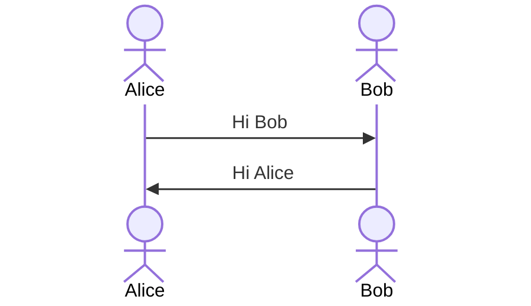
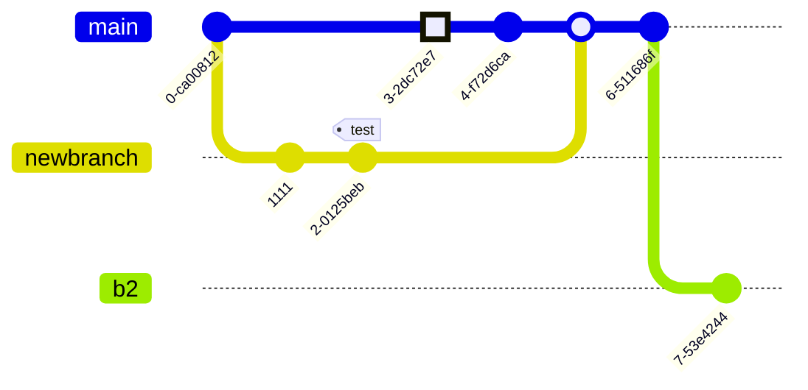
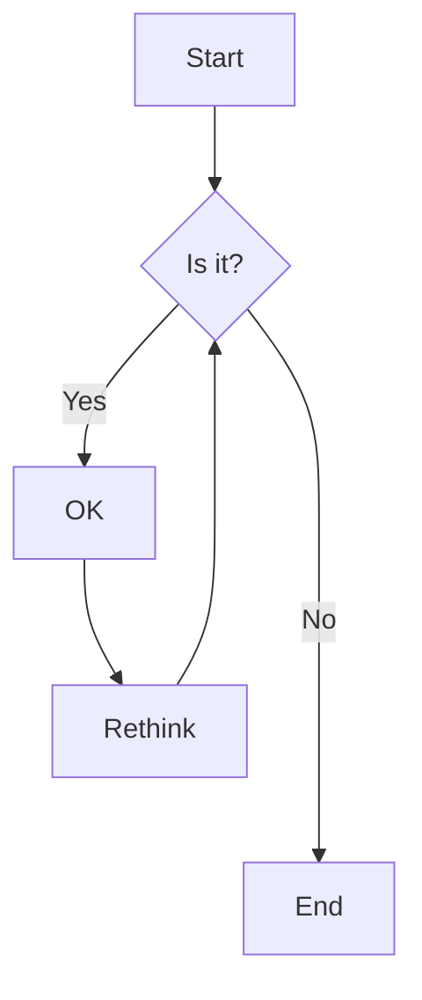
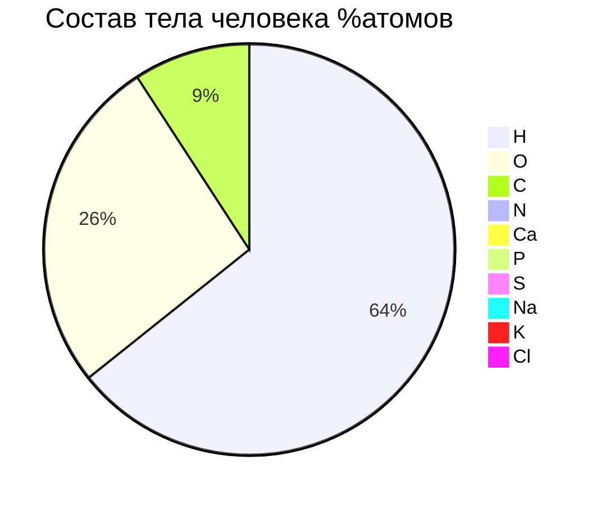

# [Блок схема](https://mermaid.js.org/syntax/flowchart.html)

```mermaid
graph TD;
  A-->B;
  A-->C;
  B-->D;
  C-->D;
```

# [Диаграммы последовательности](https://mermaid.js.org/syntax/sequenceDiagram.html)

```mermaid
sequenceDiagram
    actor Alice
    actor Bob
    Alice->>Bob: Hi Bob
    Bob->>Alice: Hi Alice
```

    

```mermaid
gitGraph:
    commit "Ashish"
    branch newbranch
    checkout newbranch
    commit id:"1111"
    commit tag:"test"
    checkout main
    commit type: HIGHLIGHT
    commit
    merge newbranch
    commit
    branch b2
    commit
```

---

```mermaid
flowchart TD
    A[Start] --> B{Is it?}
    B -->|Yes| C[OK]
    C --> D[Rethink]
    D --> B
    B ---->|No| E[End]
```
# Круговая диаграмма

```mermaid
pie
  title Состав тела человека %атомов
  "H" : 63
  "O" : 26
  "C" : 9
  "N" : 0.58
  "Ca" : 0.24
  "P" : 0.14
  "S" : 0.038
  "Na" : 0.037
  "K" : 0.033
  "Cl" : 0.024
```
