# [Блок схема](https://mermaid.js.org/syntax/flowchart.html)

# [Круговая диаграмма](https://mermaid.js.org/syntax/pie.html)
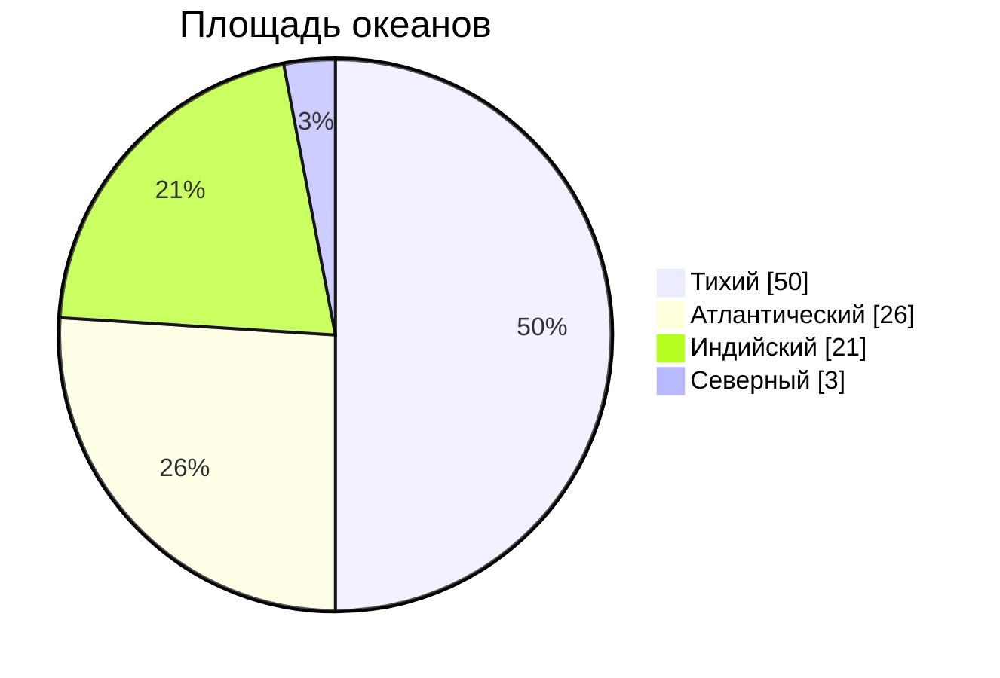

# [Диаграмма GitGraph](https://mermaid.js.org/syntax/gitgraph.html)
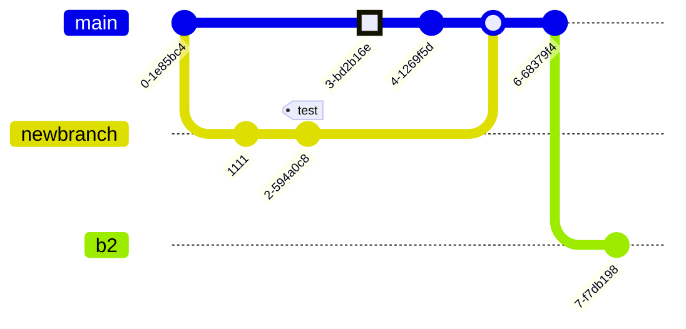

# [Диаграмма последовательности](https://mermaid.js.org/syntax/sequenceDiagram.html)
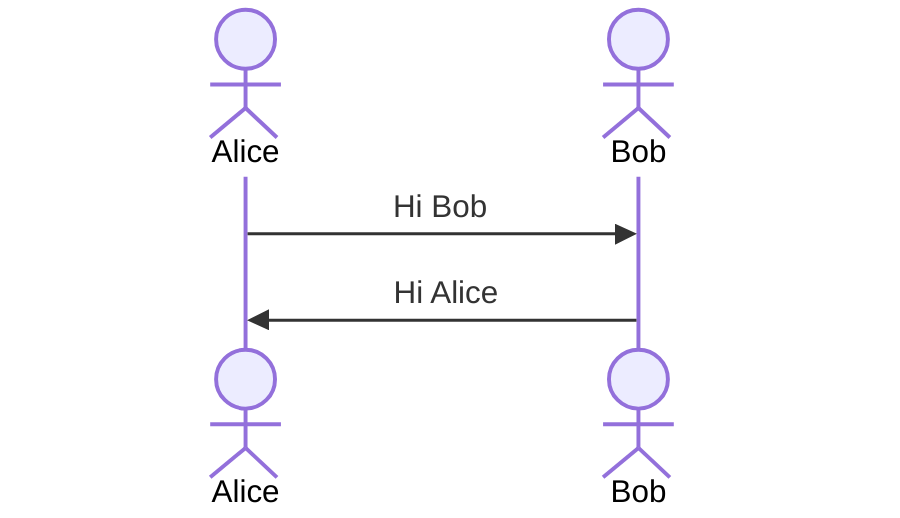

# [Диаграмма классов](https://mermaid.js.org/syntax/classDiagram.html)
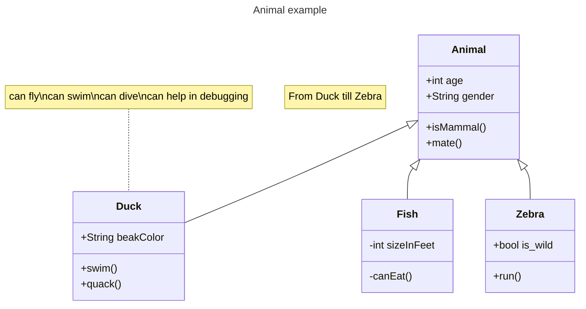

# [Диаграмма состояний](https://mermaid.js.org/syntax/stateDiagram.html)
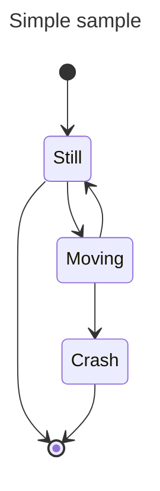

# [Диаграмма отношений сущностей](https://mermaid.js.org/syntax/entityRelationshipDiagram.html)
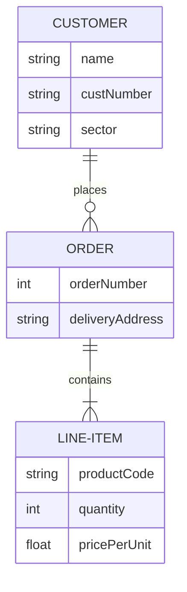

# [Диаграмма пути пользователя](https://mermaid.js.org/syntax/userJourney.html)
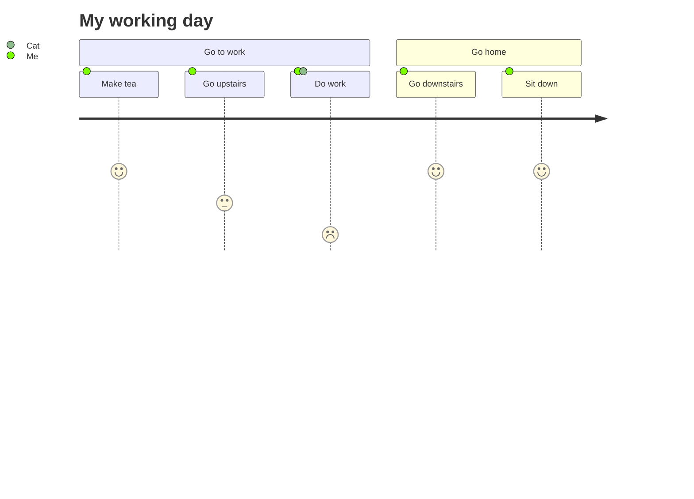

# [Хронология](https://mermaid.js.org/syntax/timeline.html)
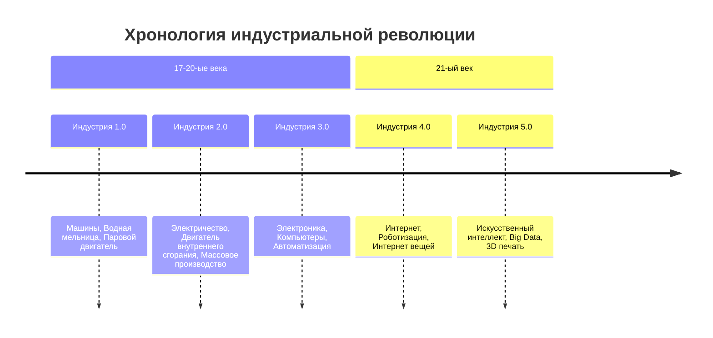

# [Диаграмма Ганта](https://mermaid.js.org/syntax/gantt.html)
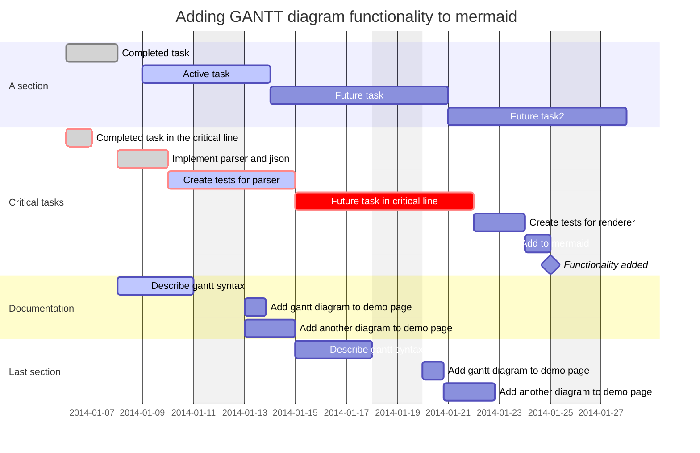

# [Квадратная диаграмма](https://mermaid.js.org/syntax/quadrantChart.html)
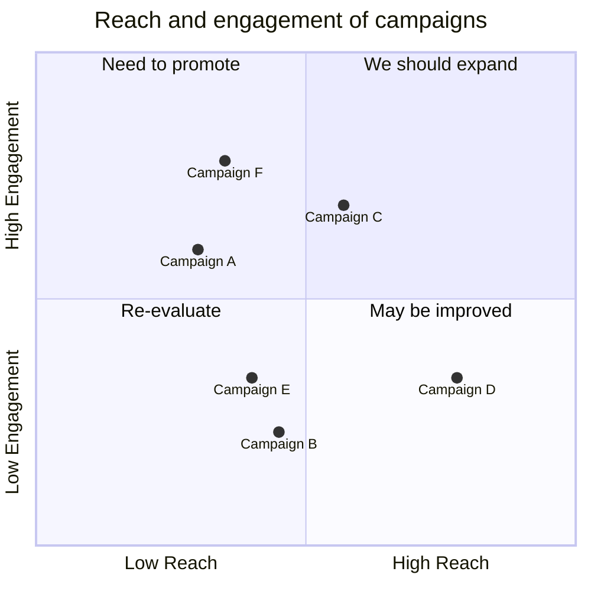

# [Диаграмма требований](https://mermaid.js.org/syntax/requirementDiagram.html)
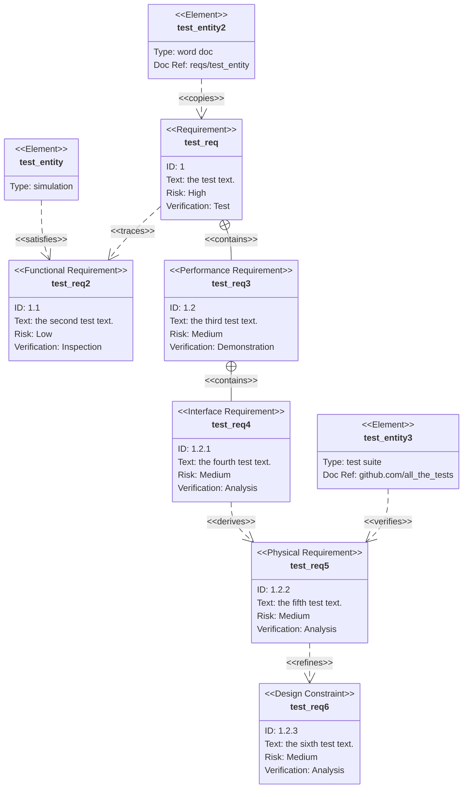

---

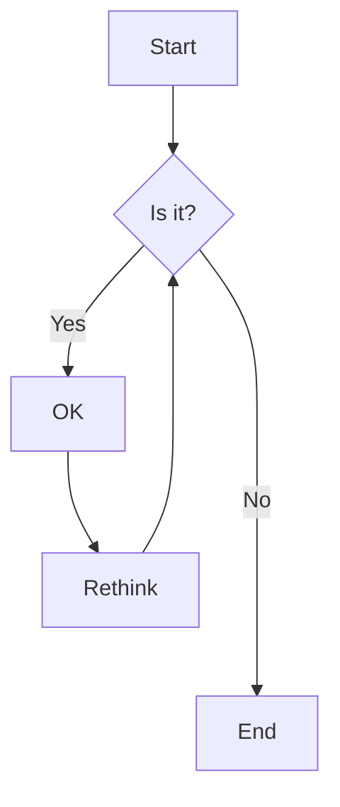
# Круговая диаграмма
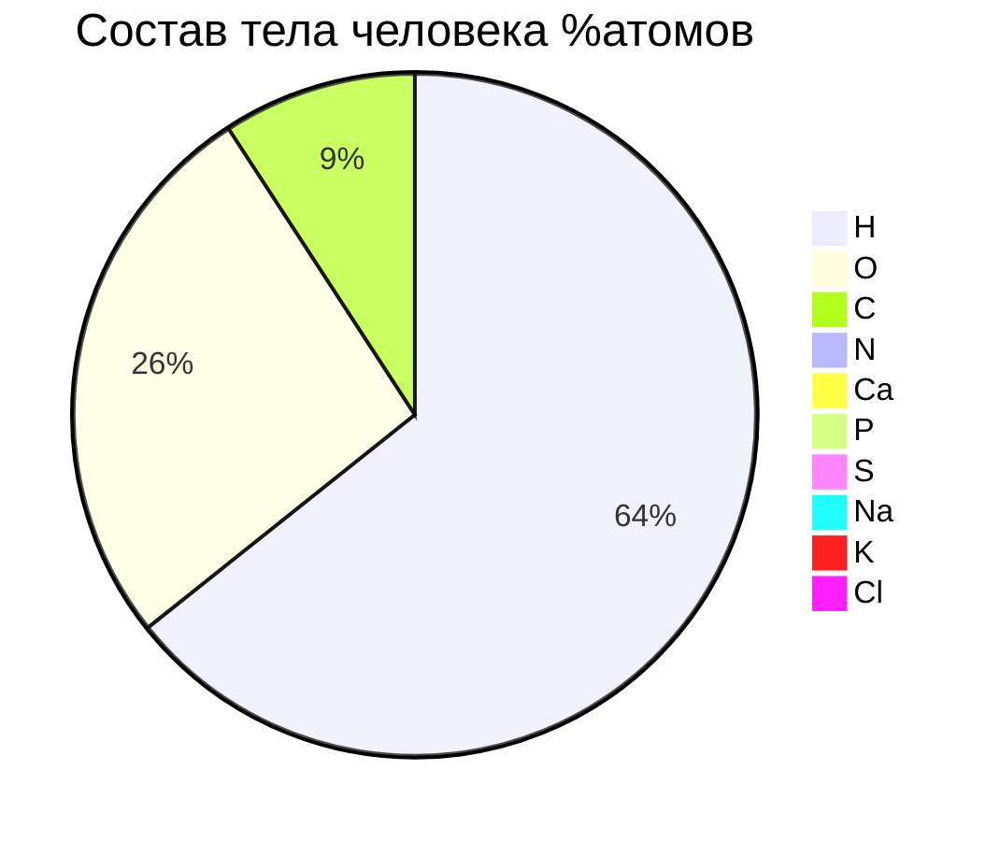
