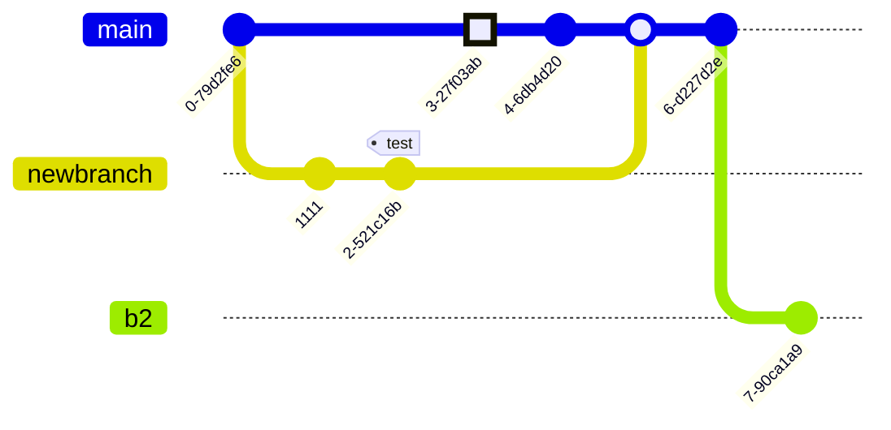

# [Блок схема](https://mermaid.js.org/syntax/flowchart.html)

# [Круговая диаграмма](https://mermaid.js.org/syntax/pie.html)

# [Диаграммы последовательности](https://mermaid.js.org/syntax/sequenceDiagram.html)

# [Диаграммы классов](https://mermaid.js.org/syntax/classDiagram.html)

# [Диаграммы состояний](https://mermaid.js.org/syntax/stateDiagram.html)

# [Диаграммы отношений сущностей](https://mermaid.js.org/syntax/entityRelationshipDiagram.html)

# [Диаграмма пути пользователя](https://mermaid.js.org/syntax/userJourney.html)

# [Диаграммы Ганта]()

    

---

# Круговая диаграмма

